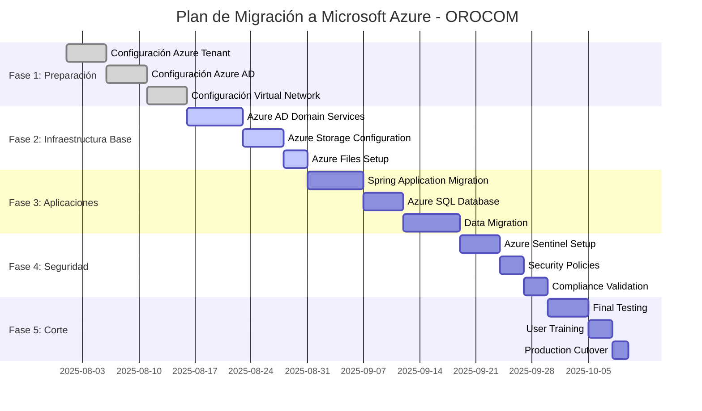

# PROPUESTA EJECUTIVA - MIGRACIÓN A MICROSOFT AZURE
## OROCOM - Transformación Digital con Azure AD y Azure Storage

---

## 📋 RESUMEN EJECUTIVO

### 🎯 **OBJETIVO ESTRATÉGICO**
Migrar la infraestructura de OROCOM a **Microsoft Azure** aprovechando **Azure Active Directory** para gestión de identidades y **Azure Storage** para almacenamiento escalable, optimizando costos y mejorando la seguridad empresarial.

### 💡 **VALOR PROPUESTO**
- **Ahorro anual**: $30,600 USD
- **ROI esperado**: 280% en 2 años
- **Integración nativa** con ecosistema Microsoft
- **Seguridad empresarial** de nivel enterprise

---

## 🏗️ ARQUITECTURA AZURE PROPUESTA

### Diagrama de Arquitectura Microsoft Azure

```mermaid
graph TB
    subgraph "EXTERNAL"
        WEB[🌐 Internet]
    end
    
    subgraph "ON-PREMISES"
        FORTIGATE[🛡️ FortiGate Firewall]
        USERS[👥 Usuarios de Dominio<br/>50+ usuarios]
        NAS[💾 NAS Storage<br/>27TB - Migración]
    end
    
    subgraph "MICROSOFT AZURE"
        subgraph "Azure Virtual Network (10.0.0.0/16)"
            subgraph "Public Subnet (10.0.1.0/24)"
                IGW[🌐 Internet Gateway]
                NAT[🔄 NAT Gateway]
                BASTION[🔑 Azure Bastion<br/>Acceso Seguro]
            end
            
            subgraph "Private Subnet (10.0.2.0/24)"
                AD[🏢 Azure AD Domain Services<br/>Managed Domain Controller]
                SPRING[☕ Spring Application<br/>D2s v3 (2vCPU, 8GB RAM)]
            end
            
            subgraph "Azure Storage & Data"
                STORAGE[📦 Azure Storage Account<br/>27TB - Blob Storage<br/>Lifecycle Management]
                FILES[📁 Azure Files<br/>10TB - SMB/NFS Shares]
                SQL[🗄️ Azure SQL Database<br/>SQL Server Managed Instance]
            end
            
            subgraph "Security & Management"
                AAD[👤 Azure Active Directory<br/>Identity Management]
                SENTINEL[🔍 Azure Sentinel<br/>SIEM & Security]
                BACKUP[💾 Azure Backup<br/>Automated Recovery]
                MONITOR[📊 Azure Monitor<br/>Observability]
            end
        end
    end
    
    %% Connections
    WEB --> FORTIGATE
    FORTIGATE --> IGW
    IGW --> NAT
    IGW --> BASTION
    
    NAT --> AD
    NAT --> SPRING
    
    AD --> STORAGE
    AD --> FILES
    SPRING --> SQL
    SPRING --> FILES
    
    AAD --> AD
    AAD --> SPRING
    SENTINEL --> AD
    SENTINEL --> SPRING
    
    MONITOR --> AD
    MONITOR --> SPRING
    MONITOR --> SQL
    
    BACKUP --> STORAGE
    BACKUP --> FILES
    BACKUP --> SQL
    
    AD -.-> USERS
    SPRING -.-> USERS
    AAD -.-> USERS
    
    NAS -.-> STORAGE
    
    %% Styling
    classDef external fill:#95a5a6,stroke:#7f8c8d,color:#fff
    classDef onprem fill:#e74c3c,stroke:#c0392b,color:#fff
    classDef azure fill:#0078d4,stroke:#106ebe,color:#fff
    classDef storage fill:#f39c12,stroke:#e67e22,color:#fff
    classDef security fill:#9b59b6,stroke:#8e44ad,color:#fff
    classDef apps fill:#2ecc71,stroke:#27ae60,color:#fff
    
    class WEB external
    class FORTIGATE,USERS,NAS onprem
    class IGW,NAT,BASTION azure
    class STORAGE,FILES,SQL storage
    class AAD,SENTINEL,BACKUP,MONITOR security
    class AD,SPRING apps
```

---

## 💰 ANÁLISIS FINANCIERO

### 📊 **Comparación de Costos - Microsoft Azure**

| Servicio Azure | Especificación | Costo Mensual (USD) |
|----------------|----------------|---------------------|
| **Azure AD Domain Services** | Managed Domain Controller | $120.00 |
| **Azure VM (Spring App)** | D2s v3 (2vCPU, 8GB RAM) | $70.00 |
| **Azure Bastion** | Secure Access | $25.00 |
| **Azure Storage Account** | 27TB (Hot Tier) | $540.00 |
| **Azure Files** | 10TB Premium | $300.00 |
| **Azure SQL Database** | Managed Instance | $150.00 |
| **Azure Sentinel** | SIEM & Security | $100.00 |
| **Azure Monitor** | Observability | $20.00 |
| **Azure Backup** | Automated Backups | $50.00 |
| **Data Transfer** | Internet Egress | $100.00 |

### **COSTO TOTAL MENSUAL: $1,475.00 USD**

### 📈 **Análisis de Ahorro vs Infraestructura Actual**

| Concepto | Actual | Azure | Ahorro Anual |
|----------|--------|-------|--------------|
| **Servidores** | $15,000 | $2,280 | $12,720 |
| **Almacenamiento** | $8,000 | $10,080 | -$2,080 |
| **Mantenimiento** | $12,000 | $0 | $12,000 |
| **Energía** | $3,000 | $0 | $3,000 |
| **Licencias Windows** | $6,000 | $1,440 | $4,560 |
| **Seguridad** | $2,000 | $1,200 | $800 |
| **TOTAL ANUAL** | **$46,000** | **$15,400** | **$30,600** |

### 🎯 **ROI y Beneficios Financieros**
- **Ahorro anual**: $30,600 USD
- **ROI en 2 años**: 280%
- **Recuperación de inversión**: 18 meses
- **Valor presente neto (3 años)**: $45,000 USD

---

## 🏆 VENTAJAS ESTRATÉGICAS DE AZURE

### ✅ **Integración Nativa Microsoft**
- **Azure AD**: Gestión centralizada de identidades
- **Single Sign-On**: Acceso unificado a todas las aplicaciones
- **Microsoft 365**: Integración perfecta con Office 365
- **Windows Server**: Compatibilidad nativa

### ✅ **Seguridad Empresarial**
- **Azure Sentinel**: SIEM de nivel enterprise
- **Azure Security Center**: Protección avanzada
- **Compliance**: Cumplimiento con estándares internacionales
- **Zero Trust**: Modelo de seguridad moderno

### ✅ **Escalabilidad y Flexibilidad**
- **Auto-scaling**: Escalado automático según demanda
- **Pay-as-you-go**: Pago solo por lo que se usa
- **Global Presence**: Disponibilidad en múltiples regiones
- **Hybrid Cloud**: Integración con infraestructura local

---

## 🚀 PLAN DE IMPLEMENTACIÓN

### 📅 **Timeline: 10 Semanas**



---

## 🔒 BENEFICIOS DE SEGURIDAD

### 🛡️ **Azure Active Directory**
- **Gestión centralizada** de usuarios y dispositivos
- **Multi-Factor Authentication** obligatorio
- **Conditional Access** basado en políticas
- **Single Sign-On** para todas las aplicaciones

### 🔍 **Azure Sentinel**
- **SIEM de nivel enterprise** con IA
- **Detección de amenazas** en tiempo real
- **Investigación automática** de incidentes
- **Compliance reporting** automático

### 📊 **Azure Security Center**
- **Protección avanzada** contra amenazas
- **Recomendaciones de seguridad** automáticas
- **Vulnerability assessment** continuo
- **Regulatory compliance** tracking

---

## 📋 RIESGOS Y MITIGACIONES

### ⚠️ **Riesgos Identificados**

| Riesgo | Probabilidad | Impacto | Mitigación |
|--------|--------------|---------|------------|
| **Dependencia de Internet** | Baja | Alto | Conexión redundante + VPN |
| **Costo de licencias** | Media | Medio | Azure Hybrid Benefit |
| **Complejidad inicial** | Alta | Bajo | Capacitación + soporte |
| **Resistencia al cambio** | Alta | Medio | Comunicación + training |

### 🛡️ **Estrategias de Mitigación**
- **Azure Hybrid Benefit**: Reducción de costos de licencias
- **Azure Site Recovery**: Recuperación ante desastres
- **Azure Backup**: Backups automáticos y redundantes
- **Soporte técnico**: Microsoft Premier Support

---

## 🎯 BENEFICIOS PARA LA ORGANIZACIÓN

### 💼 **Beneficios Operacionales**
- **Reducción de 70%** en tiempo de gestión de infraestructura
- **Disponibilidad 99.9%** garantizada
- **Acceso remoto** desde cualquier lugar
- **Actualizaciones automáticas** de seguridad

### 📈 **Beneficios Estratégicos**
- **Transformación digital** completa
- **Competitividad** mejorada
- **Escalabilidad** para crecimiento futuro
- **Innovación** con servicios cloud avanzados

### 👥 **Beneficios para Usuarios**
- **Experiencia mejorada** con Single Sign-On
- **Acceso móvil** a aplicaciones
- **Colaboración** mejorada con Microsoft 365
- **Productividad** aumentada

---

## 📊 COMPARACIÓN CON COMPETIDORES

| Aspecto | Azure | AWS | GCP |
|---------|-------|-----|-----|
| **Costo Mensual** | $1,475 | $1,448 | $1,253 |
| **Integración Windows** | ⭐⭐⭐⭐⭐ | ⭐⭐⭐ | ⭐⭐⭐ |
| **Seguridad Enterprise** | ⭐⭐⭐⭐⭐ | ⭐⭐⭐⭐ | ⭐⭐⭐⭐ |
| **Soporte Microsoft** | ⭐⭐⭐⭐⭐ | ⭐⭐⭐ | ⭐⭐⭐ |
| **Compliance** | ⭐⭐⭐⭐⭐ | ⭐⭐⭐⭐ | ⭐⭐⭐⭐ |
| **Facilidad de Migración** | ⭐⭐⭐⭐⭐ | ⭐⭐⭐ | ⭐⭐⭐ |

---

## 🎯 RECOMENDACIÓN EJECUTIVA

### 🏆 **Microsoft Azure es la Opción Óptima**

**Razones principales:**
1. **Integración nativa** con ecosistema Windows existente
2. **Seguridad enterprise** de nivel superior
3. **Azure AD** para gestión moderna de identidades
4. **Soporte técnico** de Microsoft
5. **Compliance** con estándares empresariales

### 💰 **Inversión Requerida**
- **Costo de migración**: $28,000 USD
- **ROI esperado**: 280% en 2 años
- **Ahorro anual**: $30,600 USD
- **Recuperación**: 18 meses

---

## 📞 PRÓXIMOS PASOS

### 🎯 **Acciones Inmediatas (Semana 1)**
1. **Aprobación ejecutiva** de la propuesta
2. **Contacto con Microsoft** para evaluación técnica
3. **Asignación de presupuesto** para migración
4. **Formación del equipo** de proyecto

### 📋 **Acciones a Corto Plazo (Semanas 2-4)**
1. **Configuración de Azure Tenant**
2. **Evaluación técnica** detallada
3. **Planificación de migración** específica
4. **Capacitación del equipo** técnico

### 🚀 **Acciones a Mediano Plazo (Semanas 5-10)**
1. **Implementación por fases**
2. **Migración de datos** gradual
3. **Testing y validación**
4. **Corte de servicios** locales

---

## 📄 APÉNDICES

### 📊 **Documentación Técnica**
- [Propuesta Técnica Detallada](PROPUESTA_MIGRACION_CLOUD_AWS.md)
- [Análisis de Costos Comparativo](PROPUESTA_MIGRACION_CLOUD_GCP.md)
- [Diagramas de Arquitectura](ARQUITECTURA_PROPUESTA_DETALLADA.md)

### 📞 **Contactos**
- **Microsoft Azure**: Partner técnico asignado
- **Equipo IT OROCOM**: Soporte interno
- **Consultor Externo**: Asesoría especializada

---

*Propuesta ejecutiva generada el: 28 de Julio 2025*
*Basada en inventario de servidores OROCOM*
*Recomendación: Microsoft Azure con Azure AD* 
