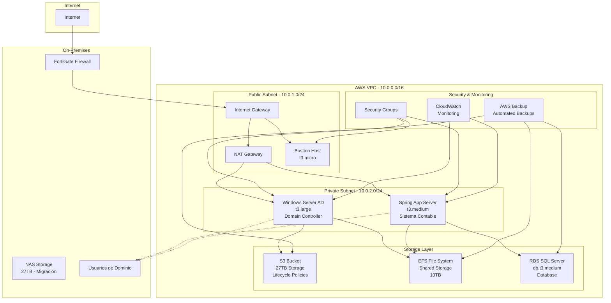

# PROPUESTA DE MIGRACIÓN A LA NUBE - AWS
## OROCOM - Migración de Infraestructura Local a AWS

### RESUMEN EJECUTIVO

Basándome en el inventario de servidores y la infraestructura actual, propongo una migración completa a AWS que incluye:
- **Windows Server Active Directory** para gestión de usuarios de dominio
- **Almacenamiento escalable** para reemplazar el NAS de 27TB
- **Servidor virtual** para el sistema contable Spring
- **Arquitectura híbrida** con FortiGate como firewall

---

## ARQUITECTURA PROPUESTA

### Diagrama de Arquitectura AWS

---

## ANÁLISIS DE COSTOS - AWS

### Servicios Principales

| Servicio | Especificación | Costo Mensual (USD) |
|----------|----------------|---------------------|
| **EC2 Windows Server AD** | t3.large (2vCPU, 8GB RAM) | $70.00 |
| **EC2 Spring Application** | t3.medium (2vCPU, 4GB RAM) | $35.00 |
| **EC2 Bastion Host** | t3.micro (2vCPU, 1GB RAM) | $8.50 |
| **S3 Storage** | 27TB (Standard) | $675.00 |
| **EFS Storage** | 10TB | $300.00 |
| **RDS SQL Server** | db.t3.medium | $150.00 |
| **NAT Gateway** | Data Transfer | $45.00 |
| **CloudWatch** | Monitoring | $15.00 |
| **AWS Backup** | Automated Backups | $50.00 |
| **Data Transfer** | Internet Egress | $100.00 |

### **COSTO TOTAL MENSUAL: $1,448.50 USD**

---

## PLAN DE MIGRACIÓN

### Fase 1: Preparación (Semana 1-2)
1. **Configuración de AWS Account**
   - Crear cuenta AWS con MFA
   - Configurar billing alerts
   - Establecer IAM roles y políticas

2. **Diseño de Red**
   - Configurar VPC con subnets públicas y privadas
   - Configurar Security Groups
   - Establecer NAT Gateway

### Fase 2: Infraestructura Base (Semana 3-4)
1. **Windows Server AD**
   - Desplegar EC2 Windows Server 2019
   - Configurar Active Directory
   - Migrar usuarios y políticas de dominio

2. **Almacenamiento**
   - Configurar S3 buckets con lifecycle policies
   - Establecer EFS para archivos compartidos
   - Configurar RDS para bases de datos

### Fase 3: Aplicaciones (Semana 5-6)
1. **Sistema Spring**
   - Desplegar EC2 para aplicación Spring
   - Migrar aplicación contable
   - Configurar conexiones a base de datos

2. **Integración**
   - Configurar DNS y routing
   - Establecer VPN con FortiGate
   - Migrar datos del NAS

### Fase 4: Pruebas y Corte (Semana 7-8)
1. **Testing**
   - Pruebas de conectividad
   - Validación de aplicaciones
   - Pruebas de rendimiento

2. **Corte de Servicios**
   - Migración final de datos
   - Corte de servicios locales
   - Monitoreo post-migración

---

## VENTAJAS DE LA PROPUESTA AWS

### ✅ **Escalabilidad**
- Storage automáticamente escalable
- Capacidad de procesamiento bajo demanda
- Reducción de costos en períodos de baja actividad

### ✅ **Seguridad**
- Security Groups y NACLs
- Encriptación en tránsito y en reposo
- Integración con FortiGate existente

### ✅ **Disponibilidad**
- 99.9% SLA de disponibilidad
- Backups automáticos
- Recuperación ante desastres

### ✅ **Costos**
- Pago por uso
- Sin costos de mantenimiento de hardware
- Optimización automática de recursos

---

## RIESGOS Y MITIGACIONES

| Riesgo | Impacto | Mitigación |
|--------|---------|------------|
| **Corte de Internet** | Alto | VPN redundante, conexión secundaria |
| **Pérdida de Datos** | Crítico | Backups múltiples, replicación cross-region |
| **Costos Inesperados** | Medio | Budget alerts, cost optimization |
| **Complejidad Técnica** | Medio | Soporte AWS, documentación detallada |

---

## PRÓXIMOS PASOS

1. **Aprobación de Propuesta**
   - Revisión técnica del equipo
   - Aprobación de presupuesto
   - Definición de timeline

2. **Preparación Técnica**
   - Configuración de AWS Account
   - Preparación de scripts de migración
   - Capacitación del equipo

3. **Inicio de Migración**
   - Comenzar con Fase 1
   - Establecer métricas de éxito
   - Comunicación a usuarios

---

## ALTERNATIVAS DE PROVEEDORES

### Microsoft Azure
- **Ventaja**: Integración nativa con Windows Server
- **Costo**: Similar a AWS (~$1,400/mes)
- **Desventaja**: Menos flexibilidad en servicios

### Google Cloud Platform
- **Ventaja**: Mejor rendimiento de red
- **Costo**: Ligeramente menor (~$1,300/mes)
- **Desventaja**: Menos madurez en servicios empresariales

### **RECOMENDACIÓN: AWS** por madurez, documentación y soporte empresarial.

---

*Propuesta generada el: 28 de Julio 2025*
*Basada en inventario de servidores OROCOM* 
