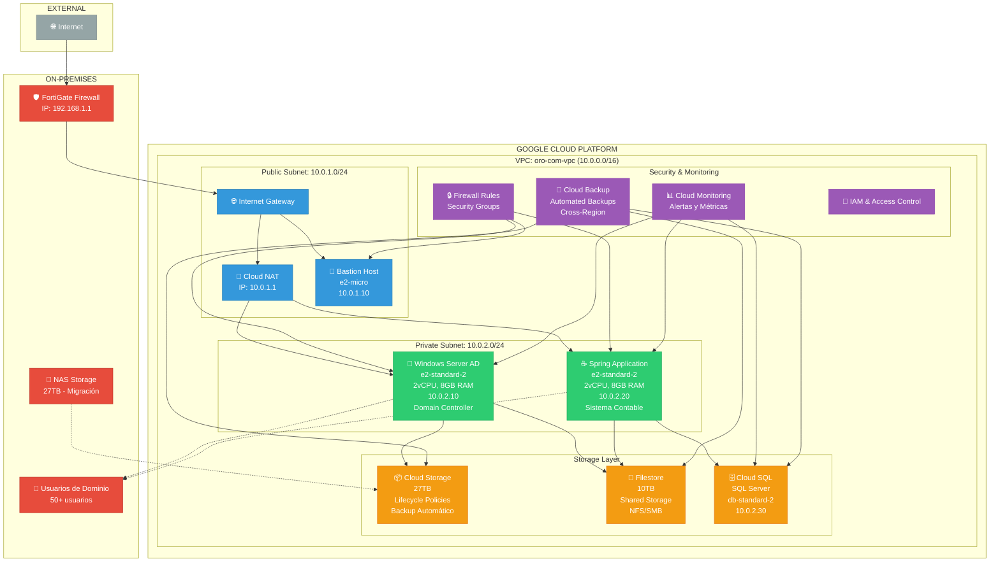
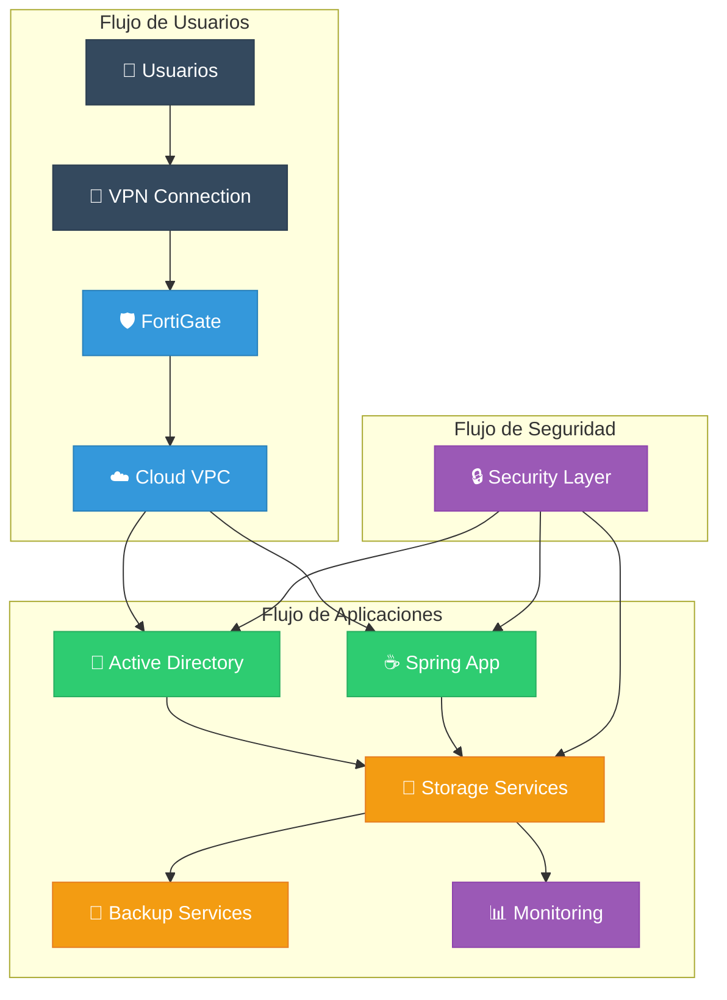
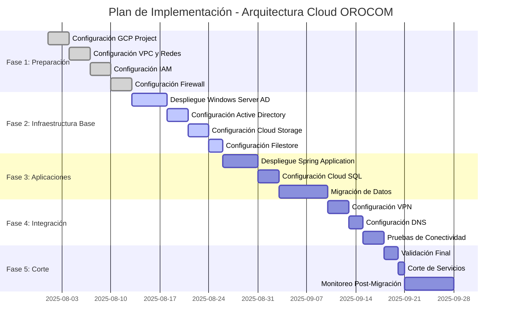
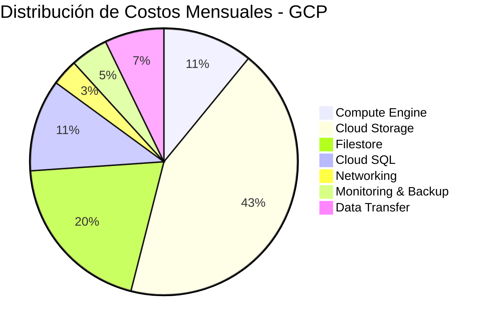

# ARQUITECTURA PROPUESTA - MIGRACIÓN A LA NUBE OROCOM

## 🏗️ ARQUITECTURA DETALLADA RECOMENDADA

### Diagrama Principal de Arquitectura



## 🔄 FLUJO DE DATOS Y CONECTIVIDAD



## 📊 ESPECIFICACIONES TÉCNICAS DETALLADAS

### 🖥️ **Servidores Virtuales**

| Componente | Especificación | Costo Mensual | Propósito |
|------------|----------------|---------------|-----------|
| **Windows Server AD** | e2-standard-2<br/>2vCPU, 8GB RAM<br/>Windows Server 2019 | $65.00 | Domain Controller, Gestión de usuarios |
| **Spring Application** | e2-standard-2<br/>2vCPU, 8GB RAM<br/>Ubuntu 20.04 LTS | $65.00 | Sistema contable Spring |
| **Bastion Host** | e2-micro<br/>2vCPU, 1GB RAM<br/>Ubuntu 20.04 LTS | $6.50 | Acceso seguro a servidores privados |

### 💾 **Almacenamiento**

| Servicio | Capacidad | Tipo | Costo Mensual | Propósito |
|----------|-----------|------|---------------|-----------|
| **Cloud Storage** | 27TB | Standard | $540.00 | Almacenamiento principal, reemplaza NAS |
| **Filestore** | 10TB | Basic | $250.00 | Archivos compartidos, NFS/SMB |
| **Cloud SQL** | 100GB | SQL Server | $140.00 | Base de datos del sistema |

### 🔒 **Seguridad y Redes**

| Componente | Especificación | Propósito |
|------------|----------------|-----------|
| **VPC** | 10.0.0.0/16 | Red virtual privada |
| **Public Subnet** | 10.0.1.0/24 | Servicios públicos (NAT, Bastion) |
| **Private Subnet** | 10.0.2.0/24 | Servidores de aplicaciones |
| **Firewall Rules** | Reglas específicas por servicio | Control de acceso |
| **IAM** | Roles y permisos granulares | Gestión de identidades |

## 🚀 PLAN DE IMPLEMENTACIÓN



## 💰 ANÁLISIS DE COSTOS DETALLADO

### 📈 **Costos Mensuales por Categoría**



### 💵 **Comparación de Costos Anuales**

| Concepto | Infraestructura Actual | GCP | Ahorro |
|----------|------------------------|-----|--------|
| **Servidores** | $15,000 | $1,638 | $13,362 |
| **Almacenamiento** | $8,000 | $9,480 | -$1,480 |
| **Mantenimiento** | $12,000 | $0 | $12,000 |
| **Energía** | $3,000 | $0 | $3,000 |
| **Licencias** | $6,000 | $1,680 | $4,320 |
| **TOTAL ANUAL** | **$44,000** | **$12,798** | **$31,202** |

## 🔧 CONFIGURACIÓN TÉCNICA

### 🌐 **Configuración de Red**

```yaml
VPC Configuration:
  Name: oro-com-vpc
  CIDR: 10.0.0.0/16
  Subnets:
    - Name: public-subnet
      CIDR: 10.0.1.0/24
      Region: us-central1
    - Name: private-subnet
      CIDR: 10.0.2.0/24
      Region: us-central1
  
  Firewall Rules:
    - Name: allow-ssh
      Ports: 22
      Source: 0.0.0.0/0
    - Name: allow-rdp
      Ports: 3389
      Source: 10.0.1.0/24
    - Name: allow-spring-app
      Ports: 8080, 8443
      Source: 10.0.2.0/24
```

### 🔐 **Configuración de Seguridad**

```yaml
IAM Roles:
  - Name: oro-com-admin
    Permissions: Owner
    Members: [admin@orocom.com]
  
  - Name: oro-com-developer
    Permissions: Editor
    Members: [dev@orocom.com]
  
  - Name: oro-com-viewer
    Permissions: Viewer
    Members: [support@orocom.com]

Security Policies:
  - Enforce MFA for all users
  - Regular security audits
  - Automated vulnerability scanning
  - Encrypted data at rest and in transit
```

## 📋 CHECKLIST DE IMPLEMENTACIÓN

### ✅ **Preparación (Semana 1-2)**
- [ ] Crear cuenta GCP con billing habilitado
- [ ] Configurar VPC y subnets
- [ ] Configurar IAM roles y políticas
- [ ] Configurar firewall rules
- [ ] Configurar Cloud NAT

### ✅ **Infraestructura Base (Semana 3-4)**
- [ ] Desplegar Windows Server AD
- [ ] Configurar Active Directory
- [ ] Configurar Cloud Storage buckets
- [ ] Configurar Filestore
- [ ] Configurar Cloud SQL

### ✅ **Aplicaciones (Semana 5-6)**
- [ ] Desplegar Spring Application
- [ ] Migrar aplicación contable
- [ ] Configurar conexiones a base de datos
- [ ] Migrar datos del NAS
- [ ] Configurar DNS

### ✅ **Integración (Semana 7-8)**
- [ ] Configurar VPN con FortiGate
- [ ] Pruebas de conectividad
- [ ] Validación de aplicaciones
- [ ] Corte de servicios locales
- [ ] Monitoreo post-migración

## 🎯 BENEFICIOS ESPERADOS

### 💡 **Beneficios Inmediatos**
- ✅ **Ahorro de costos**: $31,202 anuales
- ✅ **Eliminación de mantenimiento de hardware**
- ✅ **Escalabilidad automática**
- ✅ **Backups automáticos**

### 🚀 **Beneficios a Largo Plazo**
- ✅ **Disponibilidad 99.9%**
- ✅ **Recuperación ante desastres**
- ✅ **Acceso remoto global**
- ✅ **Actualizaciones automáticas**

---

*Arquitectura propuesta generada el: 28 de Julio 2025*
*Basada en inventario de servidores OROCOM*
*Recomendación: Google Cloud Platform* 
