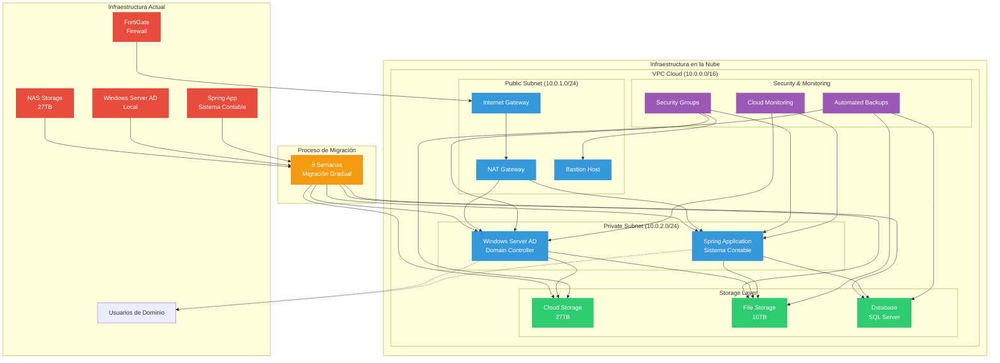
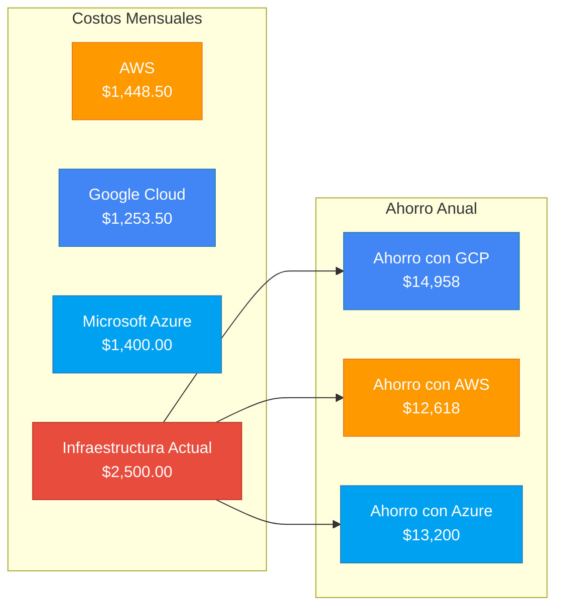
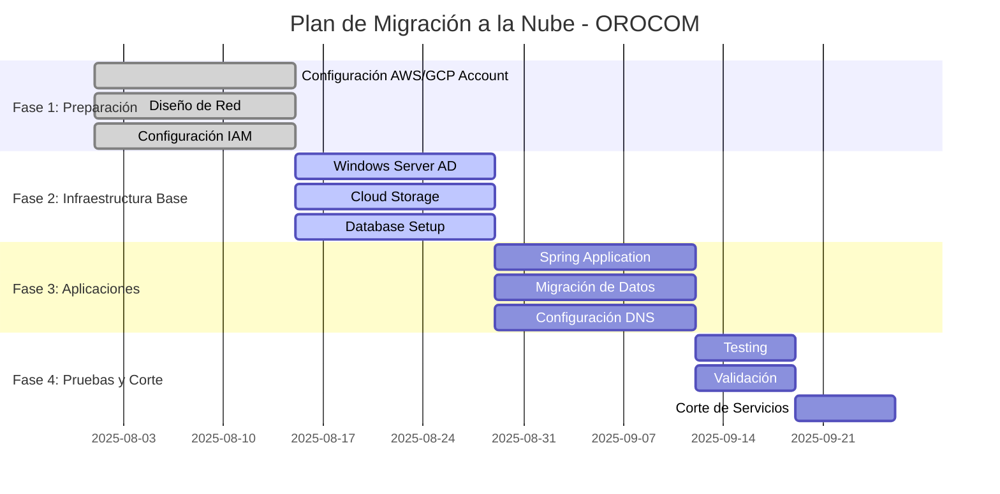
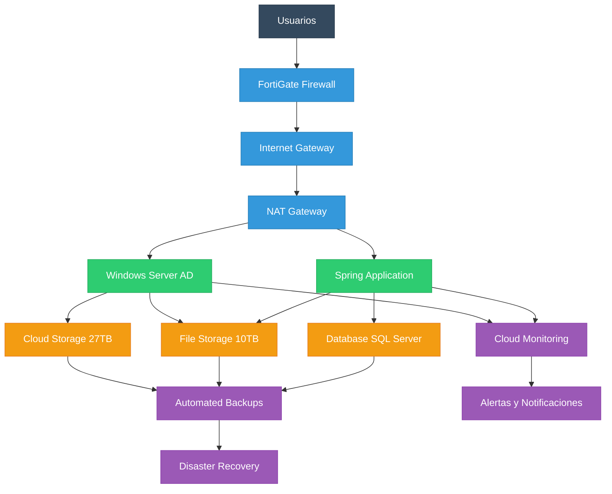

# DIAGRAMA DE MIGRACIÓN A LA NUBE - OROCOM

## Arquitectura de Migración Propuesta

## Comparación de Costos

## Plan de Migración por Fases

## Flujo de Datos en la Arquitectura Final

## Recomendación Final

### 🏆 **Google Cloud Platform (GCP)**

**Ventajas principales:**
- ✅ **Costo más bajo**: $1,253.50/mes
- ✅ **Ahorro anual**: $14,958 USD
- ✅ **Mejor rendimiento de red**
- ✅ **Herramientas de análisis avanzadas**
- ✅ **Escalabilidad automática**

**Servicios GCP recomendados:**
- **Compute Engine**: Windows Server AD y Spring Application
- **Cloud Storage**: 27TB de almacenamiento
- **Filestore**: 10TB para archivos compartidos
- **Cloud SQL**: Base de datos SQL Server
- **Cloud Monitoring**: Monitoreo y alertas
- **Cloud Backup**: Backups automáticos

---

*Diagrama generado el: 28 de Julio 2025*
*Basado en inventario de servidores OROCOM* 
