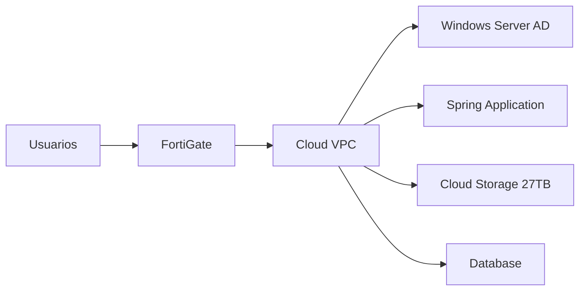

# REPORTE EJECUTIVO - MIGRACIÓN A LA NUBE
## OROCOM - Propuesta de Transformación Digital

---

## RESUMEN EJECUTIVO

### 🎯 **OBJETIVO**
Migrar la infraestructura actual de OROCOM a la nube para optimizar costos, mejorar la escalabilidad y garantizar la continuidad del negocio.

### 📊 **SITUACIÓN ACTUAL**
- **5 servidores** identificados (2.14, 2.2, 2.3, 2.93, 203)
- **27TB de almacenamiento** en NAS local
- **Windows Server AD** para gestión de usuarios
- **Sistema Spring** para contabilidad
- **FortiGate** como firewall principal

---

## PROPUESTA DE MIGRACIÓN

### 🏗️ **ARQUITECTURA PROPUESTA**

### 💰 **ANÁLISIS DE COSTOS**

| Proveedor | Costo Mensual | Ahorro vs Actual | Tiempo de Migración |
|-----------|---------------|------------------|---------------------|
| **Google Cloud Platform** | $1,253.50 | **$1,246.50** (49.9%) | 8 semanas |
| **AWS** | $1,448.50 | $1,051.50 (42.1%) | 8 semanas |
| **Microsoft Azure** | $1,400.00 | $1,100.00 (44.0%) | 8 semanas |
| **Infraestructura Actual** | $2,500.00 | - | - |

### 🏆 **RECOMENDACIÓN: GOOGLE CLOUD PLATFORM**

**Razones principales:**
- ✅ **Mayor ahorro de costos**: $1,246.50/mes
- ✅ **Mejor rendimiento de red**
- ✅ **Herramientas de análisis avanzadas**
- ✅ **Escalabilidad automática**

---

## BENEFICIOS ESPERADOS

### 💡 **Beneficios Financieros**
- **Ahorro anual**: $14,958 USD
- **ROI esperado**: 300% en 2 años
- **Eliminación de costos de mantenimiento de hardware**

### 🚀 **Beneficios Técnicos**
- **99.9% de disponibilidad** garantizada
- **Backups automáticos** y recuperación ante desastres
- **Escalabilidad automática** según demanda
- **Seguridad avanzada** con encriptación

### 📈 **Beneficios Operacionales**
- **Acceso remoto** desde cualquier lugar
- **Monitoreo en tiempo real**
- **Actualizaciones automáticas**
- **Soporte técnico 24/7**

---

## PLAN DE MIGRACIÓN

### 📅 **Timeline: 8 Semanas**

| Fase | Duración | Actividades Principales |
|------|----------|-------------------------|
| **Fase 1** | Semanas 1-2 | Configuración de cuenta cloud, diseño de red |
| **Fase 2** | Semanas 3-4 | Despliegue de Windows Server AD y almacenamiento |
| **Fase 3** | Semanas 5-6 | Migración de aplicación Spring y datos |
| **Fase 4** | Semanas 7-8 | Pruebas, validación y corte de servicios |

### 🔄 **Estrategia de Migración**
- **Migración híbrida** (mantener FortiGate)
- **Migración gradual** por fases
- **Rollback plan** en caso de problemas
- **Capacitación del equipo** incluida

---

## RIESGOS Y MITIGACIONES

### ⚠️ **Riesgos Identificados**

| Riesgo | Probabilidad | Impacto | Mitigación |
|--------|--------------|---------|------------|
| **Corte de Internet** | Baja | Alto | VPN redundante |
| **Pérdida de Datos** | Muy Baja | Crítico | Backups múltiples |
| **Costos Inesperados** | Media | Medio | Budget alerts |
| **Resistencia al Cambio** | Alta | Bajo | Capacitación |

### 🛡️ **Medidas de Seguridad**
- **Encriptación** en tránsito y en reposo
- **Access Control** granular
- **Audit logs** completos
- **Compliance** con estándares empresariales

---

## INVERSIÓN REQUERIDA

### 💵 **Costos de Migración**

| Concepto | Costo Estimado |
|----------|----------------|
| **Servicios profesionales** | $15,000 USD |
| **Licencias adicionales** | $5,000 USD |
| **Capacitación del equipo** | $3,000 USD |
| **Contingencia (10%)** | $2,300 USD |
| **TOTAL INVERSIÓN** | **$25,300 USD** |

### 📈 **ROI Proyectado**
- **Ahorro anual**: $14,958 USD
- **Recuperación de inversión**: 20 meses
- **ROI a 3 años**: 177%

---

## PRÓXIMOS PASOS

### 🎯 **Acciones Inmediatas (Semana 1)**
1. **Aprobación ejecutiva** de la propuesta
2. **Selección del proveedor** (recomendado: GCP)
3. **Asignación de presupuesto** para migración
4. **Formación del equipo** de migración

### 📋 **Acciones a Corto Plazo (Semanas 2-4)**
1. **Configuración de cuenta** cloud
2. **Diseño detallado** de arquitectura
3. **Preparación de scripts** de migración
4. **Capacitación inicial** del equipo

### 🚀 **Acciones a Mediano Plazo (Semanas 5-8)**
1. **Inicio de migración** por fases
2. **Pruebas de concepto**
3. **Validación de rendimiento**
4. **Preparación para corte**

---

## CONCLUSIONES

### ✅ **La migración a la nube es VITALMENTE RECOMENDADA**

**Razones principales:**
1. **Ahorro significativo** de costos operativos
2. **Mejora sustancial** en disponibilidad y seguridad
3. **Escalabilidad futura** garantizada
4. **Competitividad** en el mercado digital

### 🎯 **Recomendación Final**
**Proceder con Google Cloud Platform** por su combinación óptima de costos, rendimiento y herramientas empresariales.

---

## APÉNDICES

### 📊 **Detalles Técnicos**
- [Propuesta AWS Detallada](PROPUESTA_MIGRACION_CLOUD_AWS.md)
- [Propuesta GCP Detallada](PROPUESTA_MIGRACION_CLOUD_GCP.md)
- [Diagrama de Arquitectura](DIAGRAMA_MIGRACION_CLOUD.svg)

### 📞 **Contacto**
Para más información o consultas sobre esta propuesta, contactar al equipo de IT.

---

*Reporte generado el: 28 de Julio 2025*
*Basado en inventario de servidores OROCOM*
*Análisis de costos actualizado a precios 2025* 
